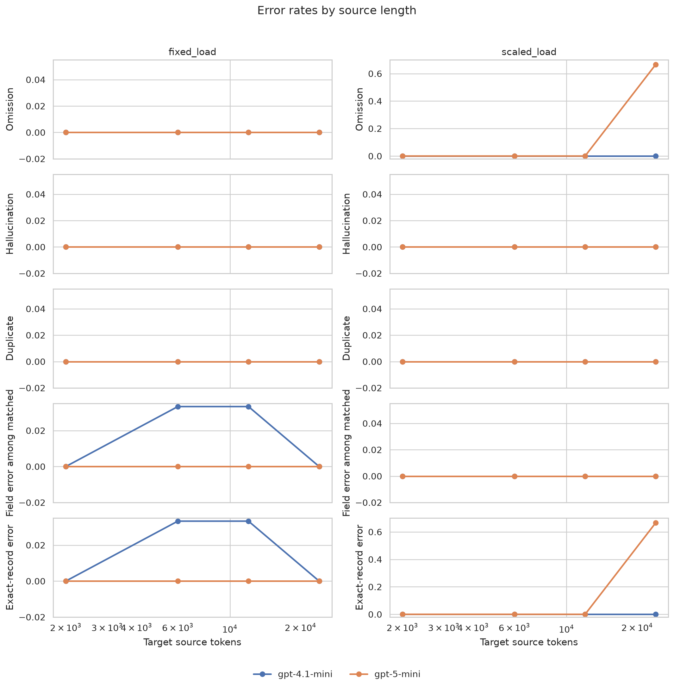
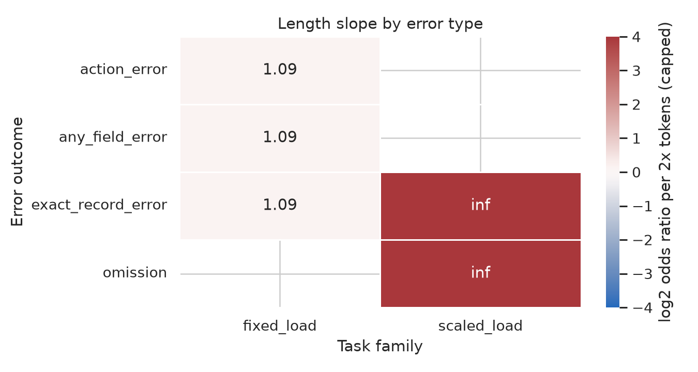

# Error Extrapolation Report

## 1. Executive Summary

This study tested how error types change when real LLMs summarize specific facts from increasingly long documents. I generated controlled long-document tasks using QMSum and GovReport text as natural background, injected known compliance-incident facts as ground truth, and ran `gpt-4.1-mini` and `gpt-5-mini` on 48 long-context summarization calls spanning roughly 2k, 6k, 12k, and 24k source tokens.

The main result is that ordinary factual errors were nearly stable over length: hallucinations and duplicates were 0 in all main runs, entity/count/month/severity/object errors were 0 after normalization, and only 2 action-field errors appeared across 536 matched predicted records. The only strong length-dependent failure was a `gpt-5-mini` visible-output failure at the hardest condition: 24k-token documents with 32 target facts under a 5,000 completion-token cap.

The practical implication is that, in this controlled setting, long-context summarization did not degrade smoothly through accumulating factual substitutions. It failed abruptly when the task crossed an output/reasoning-budget threshold. A recovery check with a 12,000-token completion budget fixed both failed `gpt-5-mini` cases with zero omissions or field errors.

## 2. Research Question & Motivation

The motivating question was: as document length increases, which LLM summarization errors remain stable and which grow, especially in regimes where humans cannot realistically ingest the full input?

Prior long-document summarization work, including BooookScore, LongDocFACTScore, FRANK, AggreFact, SummaC, and MiniCheck, shows that long-context factuality and coherence must be evaluated by error type rather than by a single summary score. The gap addressed here is direct length scaling: measuring per-error slopes while controlling the ground truth.

## 3. Experimental Setup

**Datasets.** I used the pre-downloaded QMSum Cleaned and GovReport test splits as natural background text. Synthetic compliance incident facts were injected into these documents to provide exact ground truth while preserving long natural distractor context.

**Tasks.** There were two task families:

| Family | Length bins | Target facts | Purpose |
|---|---:|---:|---|
| `fixed_load` | 2k, 6k, 12k, 24k tokens | 10 at every length | Isolate context dilution. |
| `scaled_load` | 2k, 6k, 12k, 24k tokens | 4, 8, 16, 32 | Test workload growth with length. |

Each condition had 3 replicates. With 2 models, the main experiment produced 48 model calls, 600 target records, and 536 predicted records.

**Models and API.** Models were queried through OpenAI's first-party API after confirming the authenticated model list contained `gpt-4.1-mini` and `gpt-5-mini`. The main run used JSON-mode chat completions with a 5,000 completion-token cap. A recovery check reran the two failed `gpt-5-mini` high-load cases with a 12,000-token cap.

**Metrics.** The scorer compared returned JSON records against known facts:

| Metric | Definition |
|---|---|
| Omission rate | Missing target record IDs / target records. |
| Hallucination rate | Predicted record IDs not present in source / predicted records. |
| Duplicate rate | Repeated predicted record IDs / predicted records. |
| Field errors | Unit, action, object, count, month, or severity mismatch among matched records. |
| Exact record rate | Target records with matching ID and all fields correct. |
| Parse failure | Empty or invalid JSON output. |

Normalization ignored harmless packaging differences such as putting the count into the object phrase (`239 calibration files`) when the separate count field was correct.

**Compute and environment.** The workspace used Python 3.12.8 with `openai 2.41.1`, `pandas 3.0.3`, `numpy 2.4.6`, `scipy 1.17.1`, `statsmodels 0.14.6`, `matplotlib 3.11.0`, `seaborn 0.13.2`, and `tiktoken 0.13.0`. Four NVIDIA RTX A6000 GPUs were available, each with 49,140 MiB memory, but the experiment used hosted APIs rather than local GPU inference. Total main-run usage was 534,762 prompt tokens, 85,059 completion tokens, and 1,465 seconds wall-clock API time.

## 4. Results

### Overall Main-Run Results

| Quantity | Value |
|---|---:|
| Runs | 48 |
| Target records | 600 |
| Predicted records | 536 |
| Parse failures | 2 |
| Mean omission rate | 4.17% |
| Mean hallucination rate | 0.00% |
| Mean duplicate rate | 0.00% |
| Mean field error rate among matched records | 0.43% |
| Mean exact record rate over target records | 95.42% |

The two parse failures were both `gpt-5-mini` on `scaled_load-24000` with 32 target facts. Both responses had `finish_reason="length"`, used all 5,000 completion tokens, and returned empty visible content because those tokens were consumed as reasoning tokens.

### Error Rates by Key Condition

| Model | Family | 24k-token condition | Omission | Hallucination | Duplicate | Exact record |
|---|---|---:|---:|---:|---:|---:|
| `gpt-4.1-mini` | fixed load | 10 facts | 0.0% | 0.0% | 0.0% | 100.0% |
| `gpt-4.1-mini` | scaled load | 32 facts | 0.0% | 0.0% | 0.0% | 100.0% |
| `gpt-5-mini` | fixed load | 10 facts | 0.0% | 0.0% | 0.0% | 100.0% |
| `gpt-5-mini` | scaled load | 32 facts | 66.7% | 0.0% | 0.0% | 33.3% |

Excluding parse failures, the mean omission rate was 0.0%, hallucination and duplicate rates remained 0.0%, and exact record rate rose to 99.57%. This means the observed main-run omission growth came entirely from empty visible outputs in two high-load runs, not from partial missed facts in otherwise valid summaries.

### High-Budget Recovery Check

The two failed `gpt-5-mini` `scaled_load-24000` cases were rerun with `max_completion_tokens=12000`.

| Task | Target facts | Parse failure | Missing | Hallucinated | Field errors | Reasoning tokens | Completion tokens |
|---|---:|---:|---:|---:|---:|---:|---:|
| `scaled_load-24000-0` | 32 | 0 | 0 | 0 | 0 | 2,752 | 4,900 |
| `scaled_load-24000-1` | 32 | 0 | 0 | 0 | 0 | 2,560 | 4,706 |

Both recovered completely. This converts the strongest apparent length effect into a configuration-sensitive failure mode: at high context plus high fact load, a reasoning model can spend the visible-output budget before emitting JSON.

### Statistical Tests

I fit binomial logistic models for each error indicator against log2(source tokens), with model/family controls where possible, and Benjamini-Hochberg correction over tested slopes.

| Outcome | Scope | Odds ratio per 2x tokens | BH-adjusted p | Interpretation |
|---|---|---:|---:|---|
| Omission | pooled adjusted | infinite | 0.0040 | grows in main run |
| Omission | scaled load | infinite | 0.0040 | grows in main run |
| Exact-record error | scaled load | infinite | 0.0040 | grows in main run |
| Any field error | fixed load | 1.09 | 0.8703 | approximately stable |
| Action error | fixed load | 1.09 | 0.8703 | approximately stable |

The infinite odds ratios are separation artifacts: all omission events occurred at the largest scaled-load bin. Sensitivity analysis shows this result disappears when parse failures are excluded or recovered with a larger completion budget.

## 5. Analysis & Discussion

The strongest finding is negative but useful: most factual error categories did not scale upward in this controlled experiment. With valid JSON outputs, both models almost always recovered all injected facts exactly, even at roughly 24k-token source length.

The unstable category was not hallucination, numeric drift, date drift, or entity substitution. It was a format/visible-output failure under combined high context, high fact count, and an insufficient completion budget. This matters operationally because users often interpret empty or malformed outputs as model failure, but the recovery check shows the underlying long-context retrieval was still available when the output budget was increased.

`gpt-4.1-mini` was more robust under the fixed 5,000-token cap in this setup: it completed all 24 tasks, including the 24k/32-fact scaled-load cases, with zero omissions and only two action-field errors. `gpt-5-mini` was perfect on valid outputs but had two high-load empty responses caused by length termination.

For the user's broader question, this suggests that transfer to human-impractical regimes may depend less on source length alone than on total task budget: context length, number of facts to summarize, output schema size, and hidden reasoning-token allocation. If the budget is sufficient, the models maintained the advantage in this pilot. If not, errors can grow abruptly rather than gradually.

## 6. Limitations

The injected facts were synthetic and intentionally identifiable as compliance incident notes. Real summarization often requires deciding salience and resolving implicit facts, which may produce more omissions or relation errors.

The study used only two OpenAI models, 48 main calls, and a maximum source length around 24k tokens. This is long enough to exceed typical human quick-reading workflows but far below million-token contexts.

The main omission result depends on treating parse failures as omissions. That is reasonable for an end-user summarization system, but it is not the same mechanism as retrieving a fact and then forgetting to mention it.

The JSON prompt constrained outputs tightly, which likely suppressed hallucinations and duplicates. More open-ended summaries may show different scaling.

No human annotation was performed; the controlled ground truth enabled objective scoring but did not evaluate prose quality or narrative coherence.

## 7. Conclusions & Next Steps

In this pilot, stable errors included hallucinations, duplicates, entity errors, count errors, date/month errors, severity errors, and nearly all field substitutions. The error that grew with length was an abrupt output-budget/format failure for `gpt-5-mini` under the hardest scaled-load condition, not a gradual factuality decline.

The most important follow-up is to sweep completion budgets and reasoning-effort settings at larger context lengths and fact counts. A second follow-up should replace synthetic incident notes with naturally occurring facts from GovReport/QMSum and evaluate whether salience-dependent omissions grow when facts are less explicitly marked.

## Output Files

| File | Purpose |
|---|---|
| `planning.md` | Preregistered motivation, hypotheses, and analysis plan. |
| `src/error_experiment.py` | Task generation, API calls, parsing, and scoring. |
| `src/analyze_results.py` | Statistical analysis, sensitivity summaries, and figures. |
| `src/recovery_check.py` | High-budget recovery check for failed GPT-5 cases. |
| `results/tasks.jsonl` | Generated task documents and ground truth. |
| `results/model_outputs/` | Raw main-run API outputs. |
| `results/model_outputs_high_budget/` | Raw recovery-check API outputs. |
| `results/evaluations/run_metrics.csv` | Per-run scored metrics. |
| `results/evaluations/record_metrics.csv` | Per-target-record metrics. |
| `results/evaluations/length_slopes.csv` | Logistic slope estimates. |
| `results/evaluations/sensitivity_summary.json` | Main, parse-excluded, and recovery summaries. |
| `figures/error_rates_by_length.png` | Error-rate trends by source length. |
| `figures/length_slope_heatmap.png` | Odds-ratio heatmap for length slopes. |

## References

- BooookScore, 2024, `papers/2310.00785_booookscore_book_length_summarization.pdf`.
- LongDocFACTScore, 2024, `papers/2309.12455_longdocfactscore_long_document_factuality.pdf`.
- FRANK factuality taxonomy, 2021, `papers/2104.13346_frank_factuality_error_typology.pdf`.
- AggreFact, 2023, `papers/2023_acl_aggrefact_understanding_factual_errors.pdf`.
- SummaC, 2022, `papers/2111.09525_summac_inconsistency_detection.pdf`.
- MiniCheck, 2024, `papers/2404.10774_minicheck_llm_aggrefact.pdf`.
- QMSum, 2021, `papers/2104.05938_qmsum_query_based_meeting_summarization.pdf`.
- GovReport, 2021, `papers/2104.02112_govreport_efficient_attentions_long_summarization.pdf`.
